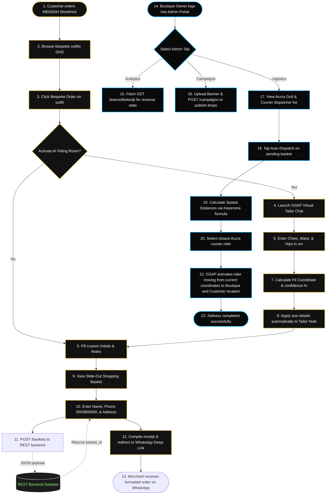

# 🧵 MENSAH | User Flow & System Architecture Guide
*(Option B: LLM Assisted Flow Submission)*

This document provides the complete structural design, data interaction flows, and system architecture for the **Mensah Luxury Storefront & Logistics Optimization Suite**. It maps out the exact customer journey and background REST exchanges with the Coded Matrix API.

---

## 📊 Visual System Flowchart



---

## 👔 1. The Buyer Storefront Journey

### Step 1: Entry & Catalog Fetch
*   **Action:** The buyer enters the luxury dark mode portal.
*   **System Event:** React launches a `fetchCatalog()` call to `GET /merchants/mensah/items`.
*   **UI Resolution:** Displays an elegant asymmetrical grid layout featuring the 10 premium outfits pre-seeded in the database as `in_stock: true`. Prices are converted from the minor unit (pesewas) to GHS by dividing `price_minor` by 100.

### Step 2: Virtual Fitting Room Chatbot
*   **Action:** The customer selects an outfit and triggers the **AI Virtual Fitting Room**.
*   **UI/UX (GSAP):** A dark chatbot console slides into view. Custom GSAP timelines animate the digital tailor avatar introducing itself.
*   **Interactive Chat Sequence:**
    1.  **Tailor Bot:** *"Greetings. I am your Mensah digital tailor. What is your chest measurement in cm?"*
        *   **User:** Inputs chest (e.g., `96`). GSAP animates the user's bubble sliding upwards.
    2.  **Tailor Bot:** *"Excellent. Next, what is your waist measurement in cm?"*
        *   **User:** Inputs waist (e.g., `80`).
    3.  **Tailor Bot:** *"Splendid. Finally, what is your hip measurement in cm?"*
        *   **User:** Inputs hips (e.g., `98`).
    4.  **Sizing Calculation:** The system computes the average metric boundaries and fit cuts (Slim, Tailored, Classic) to determine their size.
        *   *Formula Output:* Size Label (e.g., `Bespoke Tailored M`) and Fit confidence (e.g., `97% Match`).
        *   **GSAP Animation:** The matching score wave progress bar expands across the container with elastic easing.
    5.  **User Binding:** Tapping "Apply Sizing" automatically structures and prepends this tailored coordinate into the item note.

### Step 3: Basket assembly
*   **Action:** Customer specifies optional monogram initials (e.g., `JM` to be sewn in gold thread) and commits the custom items to the slide-out Cart Drawer.

### Step 4: WhatsApp Checkout Handshake
*   **Action:** Customer enters Name, Phone (pre-filled with `0593800950`), and shipping address, then taps *"Checkout via WhatsApp"*.
*   **API Transmission:** The frontend compiles a payload and sends a `POST /baskets` request containing:
    ```json
    {
      "merchant_id": "mensah",
      "team_slug": "likekodji",
      "items": [{"item_id": "outfit-1", "qty": 1, "item_note": "Size: Bespoke M (Tailored). Gold Cuff Monogram: JM"}],
      "customer_name": "Customer Name",
      "customer_phone": "0593800950",
      "customer_note": "East Legon Delivery"
    }
    ```
*   **Response Handshake:** API responds with a short, secure reference: `{"id": "basket_id"}`.
*   **WhatsApp Redirect:** The client-side constructs a URL-encoded receipt including the itemized prices, custom initials, and the secure `basket_id` link. It redirects the customer to:
    `https://wa.me/233593800950?text={urlencoded_receipt}`
    opening the merchant chat directly with the order pre-filled.

---

## 🚚 2. The Seller Operations & Last-Mile Logistics

### Step 1: Live Analytics Tracking
*   **Action:** The merchant opens the Portal Admin panel.
*   **System Event:** Frontend requests `GET /teams/likekodji`.
*   **UI Resolution:** Renders total revenue counters, basket histories, and lookbook stats registered under our slug.

### Step 2: The Last-Mile Proximity Matcher
*   **Action:** The boutique owner navigates to the **Logistics Engine** tab to dispatch a courier for a pending checkout order.
*   **Spatial Proximity Algorithm:**
    *   The boutique location is centered at `BOUTIQUE_LAT: 5.6037` and `BOUTIQUE_LNG: -0.1870` in Accra.
    *   3 couriers are scattered across Accra coordinates: Kojo Rider (Accra Mall), Yaw Dispatch (Osu), and Akosua Cantonments (Cantonments).
    *   The logistics engine computes the **Haversine spatial distance** between each courier's coordinates $(lat_1, lon_1)$ and the boutique $(lat_2, lon_2)$:
        $$\Delta\phi = lat_2 - lat_1, \quad \Delta\lambda = lon_2 - lon_1$$
        $$a = \sin^2\left(\frac{\Delta\phi}{2}\right) + \cos(lat_1)\cos(lat_2)\sin^2\left(\frac{\Delta\lambda}{2}\right)$$
        $$c = 2\cdot\operatorname{atan2}(\sqrt{a}, \sqrt{1-a}), \quad d = R\cdot c \quad (R = 6371\text{ km})$$
    *   The courier with the minimum calculated distance $d$ is automatically matched.

### Step 3: GSAP Map Animation
*   **UX/UI Event:** Tapping "Auto-Dispatch" initiates a GSAP motion timeline:
    1.  The matched courier dot on the Accra vector map moves smoothly to the Boutique pin (pickup sequence).
    2.  An informational status banner alerts: *"Bespoke order picked up at Boutique. Easing delivery route to customer..."*
    3.  The courier dot moves from the Boutique central to the target Accra neighborhood pin (e.g. East Legon or Cantonments) representing the customer destination.
    4.  GSAP triggers a final scale animation on the destination pin and issues a delivery success toast!
